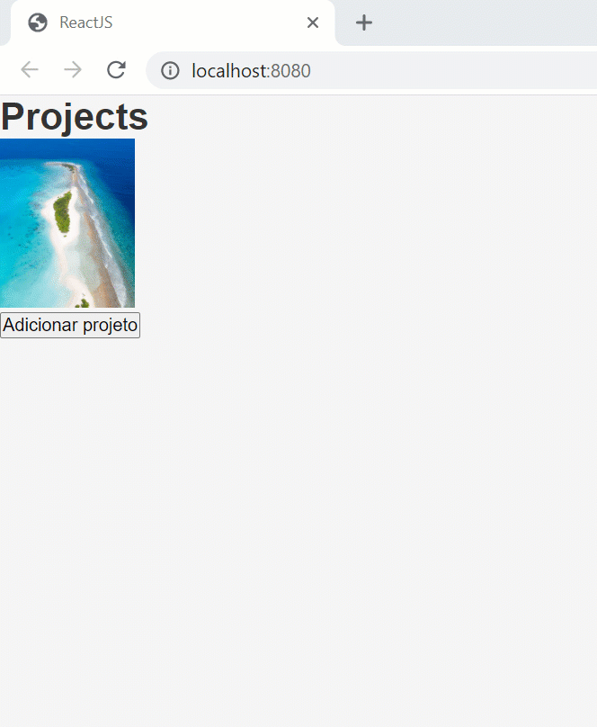

# React JS - A simple test project 

Exercise on ReactJS for the Bootcamp GoStack - Rocketseat.

Add a record in the backend by clicking the button "Adicionar projeto".

The purpose of the project was to test useState and useEffect. That way, there is no form to add new records.

### Some of the features used in this project: 
React </br>
&nbsp;&nbsp;&nbsp;useState </br>
&nbsp;&nbsp;&nbsp;useEffect </br>
&nbsp;&nbsp;&nbsp;Components </br>
Axios (to integrate with the backend) </br>
Importing css and images </br>
Babel </br>
webpack </br>


### Installation
Install and run the back-end:
[simple-test-project-nodejs](https://github.com/rlovatto/simple-test-project-nodejs)


To install all dependencies for this project:

```
yarn
```

To run the project:

```
yarn dev
```

### Node.js back-end for this project:

[simple-test-project-nodejs](https://github.com/rlovatto/simple-test-project-nodejs)


<br/><br/>


